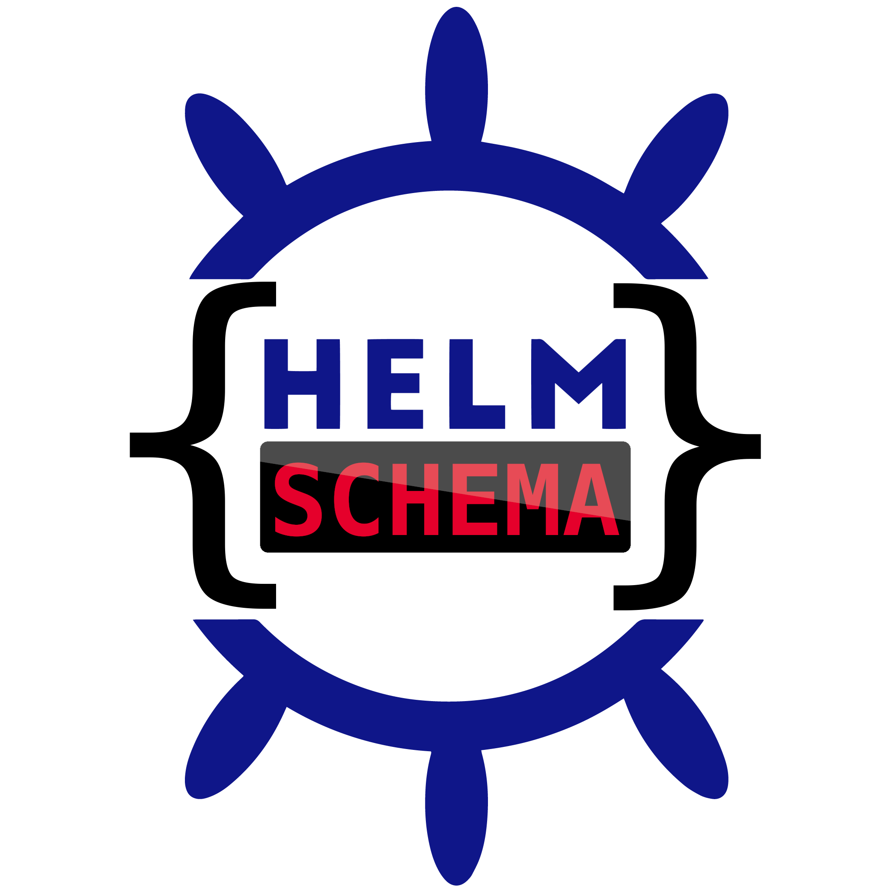

# helm-schema

<p align="center">
  
  <br />
  <a href="https://github.com/dadav/helm-schema/releases"></a>
  <a href="https://pkg.go.dev/github.com/dadav/helm-schema?tab=doc"></a>
  <a href="https://github.com/dadav/helm-schema/actions"></a>
  <a href="https://opensource.org/licenses/MIT"></a>
  <a href="https://github.com/pre-commit/pre-commit"></a>
  <a href="https://goreportcard.com/badge/github.com/dadav/helm-schema"></a>
</p>

`helm-schema` generates `values.schema.json` from Helm values and `@schema` comments, giving chart users editor completion and validation through Helm.

By default it recursively finds `Chart.yaml` files below the current directory and generates a schema from each chart's `values.yaml`. With multiple `--value-files`, it merges all matching files in the supplied order; later files take precedence. Discovered application dependencies are included under their chart name or alias in the parent's schema.

[Quickstart](#quickstart) · [Usage](#usage) · [Annotations](#annotations) · [Dependencies](#dependencies) · [CI checks](#check-mode-ci)

> [!NOTE]
> The tool uses `jsonschema` Draft 7, because the library helm uses only supports that version.

## Installation

Via Go (Go 1.26 or later is required to build the current source):

```sh
go install github.com/dadav/helm-schema/cmd/helm-schema@latest
```

Make sure your Go binary directory (`go env GOBIN`, or `$(go env GOPATH)/bin` when GOBIN is empty) is on `PATH`. For repeatable CI builds, replace `latest` with a release version such as `X.Y.Z`, using a version from the [releases page](https://github.com/dadav/helm-schema/releases).

From `aur`:

```sh
paru -S helm-schema
```

Via `podman/docker`:

```sh
podman run --rm -v "$PWD:/home/helm-schema" ghcr.io/dadav/helm-schema:latest
```

As a Helm 3 plugin:

```sh
helm plugin install https://github.com/dadav/helm-schema
```

> [!IMPORTANT]
> For Helm 4, use the verified release-tarball installation below. Since Helm v4.2, plugin signature verification is enabled by default, and
> installing from a git repository URL fails with
> `plugin source does not support verification`, because git sources cannot be
> verified by Helm. Either install from a release tarball with verification
> (recommended, see below) or explicitly skip verification:
>
> ```sh
> helm plugin install https://github.com/dadav/helm-schema --verify=false
> ```

### Plugin Verification (Helm v4+)

All helm-schema releases are signed with GPG and include provenance files
(`.prov`) so Helm can verify them. Helm can only verify plugins installed from
a release tarball URL (`.tar.gz`), not from a git repository URL.

**Step 1: Import the signing key**

Helm reads public keys from the legacy GPG keyring format. The simplest way is
to write the key to a standalone keyring file:

```sh
curl -fsSL https://raw.githubusercontent.com/dadav/helm-schema/main/signing-key.asc \
  | gpg --dearmor > helm-schema-keyring.gpg
```

Alternatively, import it into your regular GnuPG setup and export it in the
legacy format Helm expects:

```sh
# Import by key ID (last 16 hex chars of the fingerprint)
gpg --keyserver keyserver.ubuntu.com --recv-keys F58707969D0FBFA5

# Verify the imported key fingerprint (expect: 806F 70D2 5667 D42A AE4E 07CE F587 0796 9D0F BFA5)
gpg --fingerprint F58707969D0FBFA5

# Export from the modern kbx store into the legacy format at Helm's default keyring location
gpg --export F58707969D0FBFA5 > ~/.gnupg/pubring.gpg
```

**Step 2: Install from a release tarball**

Replace `X.Y.Z` with a release version (no `v` prefix, e.g. `0.23.4`) and pick
your OS/architecture from the release assets:

```sh
# Verified against Helm's default keyring (~/.gnupg/pubring.gpg)
helm plugin install https://github.com/dadav/helm-schema/releases/download/X.Y.Z/helm-schema_X.Y.Z_Linux_x86_64.tar.gz --verify

# Or point Helm at the standalone keyring file from step 1
helm plugin install https://github.com/dadav/helm-schema/releases/download/X.Y.Z/helm-schema_X.Y.Z_Linux_x86_64.tar.gz \
  --verify --keyring helm-schema-keyring.gpg
```

**Verify Installed Plugin**

```sh
# Verify an already installed plugin
helm plugin verify schema
```

> [!NOTE]
> Plugin verification requires Helm v4 or later. If using Helm v3, signatures
> will be ignored.

## Quickstart

This example requires Helm and the `helm-schema` binary on `PATH`. If you installed the plugin, replace `helm-schema` with `helm schema` in the commands below.

Create a small chart in a directory that does not already contain `schema-demo`:

```sh
mkdir -p schema-demo/templates
cat > schema-demo/Chart.yaml <<'EOF'
apiVersion: v2
name: schema-demo
version: 0.1.0
EOF
cat > schema-demo/values.yaml <<'EOF'
# @schema
# type: integer
# minimum: 1
# required: true
# @schema
# Number of application replicas.
replicaCount: 1
EOF
cat > schema-demo/templates/configmap.yaml <<'EOF'
apiVersion: v1
kind: ConfigMap
metadata:
  name: {{ .Release.Name }}
data:
  replicaCount: {{ .Values.replicaCount | quote }}
EOF
```

Generate the schema and validate the chart without connecting to a cluster:

```sh
helm-schema -c schema-demo --add-schema-reference
helm lint schema-demo
helm template demo schema-demo
helm-schema -c schema-demo --check
```

The generator writes `schema-demo/values.schema.json` and adds an editor reference to `values.yaml`. The Helm commands succeed with the default value. This override fails because `replicaCount` must be at least 1:

```sh
helm template demo schema-demo --set replicaCount=0
```

`helm-schema` checks schema structure during generation. Helm checks the final merged values, including overrides, during `lint`, `template`, `install`, and `upgrade`. See [Helm schema validation](https://helm.sh/docs/topics/charts/#schema-files). Commit the values file and generated schema together; regenerate after changing values or annotations.

## Usage

### Pre-commit hook

If you want to automatically generate a new `values.schema.json` if you change the `values.yaml`
file, you can do the following:

1. Install [`pre-commit`](https://pre-commit.com/#install)
2. Add this hook to your chart repository's `.pre-commit-config.yaml`. Replace `X.Y.Z` with the release version you use locally and in CI.

```yaml
repos:
  - repo: https://github.com/dadav/helm-schema
    rev: X.Y.Z
    hooks:
      - id: helm-schema
        pass_filenames: false
        args: [--chart-search-root=charts/my-app, --keep-existing-dep-schemas]
```

3. Then run these commands:

```sh
pre-commit install
pre-commit install-hooks
```

The hook generates schemas and can modify tracked files. Review and stage the generated changes, then retry the commit. Build dependencies before running the hook when your chart uses subcharts. If you use custom values filenames or local schema references, extend the hook's `files` pattern to include those inputs; the default matches `Chart.yaml` and `values.yaml`.

### Running the binary directly

You can also just run the binary yourself:

```sh
helm-schema
```

### Options

The binary has the following options:

```text
Flags:
  -r, --add-schema-reference                  add reference to schema in values.yaml if not found
  -w, --allow-circular-dependencies           allow circular dependencies without dependency ordering; merges may be incomplete
  -A, --annotate                              write inferred @schema annotations into values.yaml files for unannotated keys
  -a, --append-newline                        append newline to generated jsonschema at the end of the file
  -c, --chart-search-root string              directory to search recursively within for charts (default ".")
  -C, --check                                 check that existing schema files are up-to-date; exit nonzero if any are missing or stale, without writing files
  -i, --dependencies-filter strings           only generate schema for specified dependencies (comma-separated list of dependency names)
  -g, --dont-add-global                       dont auto add global property
  -x, --dont-strip-helm-docs-prefix           disable the removal of the helm-docs prefix (--)
  -d, --dry-run                               print generated output without modifying values or schema files
  -p, --helm-docs-compatibility-mode          parse and use helm-docs comments
  -h, --help                                  help for helm-schema
  -K, --keep-existing-dep-schemas             use dependency charts' pre-existing values.schema.json instead of regenerating from values.yaml
  -s, --keep-full-comment                     keep the whole leading comment (default: cut at empty line)
  -l, --log-level string                      level of logs that should be printed, one of (panic, fatal, error, warning, info, debug, trace) (default "info")
  -n, --no-dependencies                       skip dependency charts: don't merge them into parents and don't generate their schemas
  -o, --output-file string                    jsonschema file path relative to each chart directory to which jsonschema will be written (default "values.schema.json")
  -k, --skip-auto-generation strings          comma separated list of fields to skip from being created by default (possible: title, description, required, default, additionalProperties)
  -m, --skip-dependencies-schema-validation   skip schema validation for dependencies by setting additionalProperties to true and removing from required
  -u, --uncomment                             consider yaml which is commented out
  -f, --value-files strings                   values filenames relative to each chart; merge all matches in the order provided (default [values.yaml])
  -v, --version                               version for helm-schema
```

For schema generation, `helm-schema` checks each `--value-files` entry for the chart, keeps the ones that exist, and merges them in the order provided. Later files take precedence over earlier files, following Helm's `-f/--values` behavior.

`--annotate` does not merge multiple files. It only annotates the first matching values file.

`--add-schema-reference` also targets the first matching values file.

### Multiple values files

For an existing chart at `charts/my-app`, generate and check with the same ordered list:

```sh
helm-schema -c charts/my-app -f values.yaml,values.prod.yaml
helm-schema -c charts/my-app -f values.yaml,values.prod.yaml --check
helm lint charts/my-app -f charts/my-app/values.prod.yaml
```

Filenames are relative to each discovered chart directory. Nested maps merge recursively; later scalars and arrays replace earlier ones. Missing files are skipped, and generation fails if none of the configured files exists. Empty, comment-only, and top-level null files contribute an empty map. A nested `null` remains a value. Later comments replace earlier comments when present; otherwise earlier annotations are retained.

The resulting schema describes the merged configuration. To maintain different schemas for different environments, generate them separately with `-o`; Helm automatically uses only `values.schema.json` at the chart root.

### Editor references

```sh
helm-schema -c charts/my-app --add-schema-reference
```

This adds a `# yaml-language-server: $schema=...` comment to the first matching values file. The path is relative to that values file and respects `--output-file`, including values files in subdirectories. Existing schema directives are preserved, so edit an existing directive yourself when changing its target. `--dry-run` does not modify values files.

### Annotate mode

Use `--annotate` to add inferred `# @schema` type blocks to a values file instead of generating `values.schema.json`.

- Keys that already have `@schema` annotations are left unchanged.
- With `-d, --dry-run`, the annotated file is printed to stdout instead of being written back.
- When multiple `--value-files` entries are configured, annotate mode uses only the first matching file.

### Check mode (CI)

Use `-C, --check` to verify that committed `values.schema.json` files are up-to-date without writing anything. The command regenerates each schema in memory and compares it byte-for-byte against the file on disk. If any schema is missing or stale, it logs the offending charts and exits with a nonzero status.

Schemas generated inside temporary archive extraction directories are compiled and merged into their parents, but are not compared against temporary files. Changes to packaged dependencies are checked through the generated parent schema. Schemas reused with `-K` are treated as source inputs rather than generated outputs.

`--check` cannot be combined with `--dry-run`, `--annotate`, or `--add-schema-reference`.

`--check` checks freshness, not whether your deployment values satisfy the schema. Use Helm for that second check. Keep the same helm-schema version, values-file order, and generation flags in local development, pre-commit, and CI, including `--append-newline` if used.

After installing Helm and a pinned helm-schema release in CI, use these steps for a chart with dependencies:

```yaml
- name: Build chart dependencies
  run: helm dependency build charts/my-app
- name: Verify Helm schemas are up-to-date
  run: helm-schema -c charts/my-app -K --check
- name: Validate chart values and templates
  run: |
    helm lint charts/my-app
    helm template ci charts/my-app
```

Commit `Chart.lock` for reproducible dependency builds. For charts without dependencies, omit the dependency-build step and `-K`. To validate an environment override, pass its `-f` argument to both Helm commands and use the corresponding values-file list for generation and checking.

If a schema is stale, regenerate locally with the same flags and commit the updated `values.schema.json`. Archive extraction errors fail the command before schemas or values files are modified; replace corrupt dependency archives before retrying.

## Annotations

The `jsonschema` must be between two entries of `# @schema` :

```yaml
# @schema
# my: annotation
# @schema
# you can add comment here as well
foo: bar
```

> [!WARNING]
> It must be written just above the key you want to annotate.

> [!NOTE]
> If you don't use the `properties` option on hashes/objects or don't use `items` on arrays, it will be parsed from the values and their annotations instead.

### Root-level annotations

You can apply schema annotations to the root schema object itself using `# @schema.root`:

```yaml
# @schema.root
# title: My Chart Values
# description: Configuration values for my Helm chart
# x-custom-field: custom-value
# @schema.root
# @schema
# enum: [dev, staging, prod]
# @schema
# Example description foo baz
stage: dev
```

> [!NOTE]
> The `@schema.root` block must be placed before the first key in your `values.yaml` file, without blank lines after it (unless you use the `-s` flag to keep full comments).

### Available annotations

<!-- prettier-ignore -->
| Key| Description | Values |
|-|-|-|
| [`type`](#type) | Defines the [jsonschema-type](https://json-schema.org/understanding-json-schema/reference/type.html) of the object. Multiple values are supported (e.g. `[string, integer]`) as a shortcut to `anyOf` | `object`, `array`, `string`, `number`, `integer`, `boolean` or `null` |
| [`title`](#title) | Defines the [title field](https://json-schema.org/understanding-json-schema/reference/generic.html?highlight=title) of the object | Defaults to the key itself |
| [`description`](#description) | Defines the [description field](https://json-schema.org/understanding-json-schema/reference/generic.html?highlight=description) of the object. | Defaults to the comments just above or below the `@schema` annotations block |
| [`default`](#default) | Documents a default for editors; it does not insert values into Helm's configuration | Takes a JSON value |
| [`properties`](#properties) | Contains a map with keys as property names and values as schema | Takes an `object` |
| [`pattern`](#pattern) | Regex pattern to test the value | Takes an `string` |
| [`format`](#format) | The [format keyword](https://json-schema.org/understanding-json-schema/reference/string.html#format) allows for basic semantic identification of certain kinds of string values | Takes a [keyword](https://json-schema.org/understanding-json-schema/reference/string.html#format) |
| [`required`](#required) | Adds the key to the required items | `true` or `false` or `array` |
| [`deprecated`](#deprecated) | Marks the option as deprecated | `true` or `false` |
| [`items`](#items) | Contains the schema that describes the possible array items | Takes an `object` |
| [`enum`](#enum) | Multiple allowed values | Takes an array of JSON values |
| [`const`](#const) | Single allowed value | Takes a JSON value |
| [`examples`](#examples) | Some examples you can provide for the end user | Takes an `array` |
| [`minimum`](#minimum) | Minimum value. Can't be used with `exclusiveMinimum` | Takes a `number` (integer or float). Must be smaller than `maximum` or `exclusiveMaximum` (if used) |
| [`exclusiveMinimum`](#exclusiveminimum) | Exclusive minimum. Can't be used with `minimum` | Takes a `number` (integer or float). Must be smaller than `maximum` or `exclusiveMaximum` (if used) |
| [`maximum`](#maximum) | Maximum value. Can't be used with `exclusiveMaximum` | Takes a `number` (integer or float). Must be bigger than `minimum` or `exclusiveMinimum` (if used) |
| [`exclusiveMaximum`](#exclusivemaximum) | Exclusive maximum value. Can't be used with `maximum` | Takes a `number` (integer or float). Must be bigger than `minimum` or `exclusiveMinimum` (if used) |
| [`multipleOf`](#multipleof) | The yaml-value must be a multiple of. For example: If you set this to 0.1, allowed values would be 0, 0.1, 0.2... | Takes a `number` (integer or float, must be > 0) |
| [`additionalProperties`](#additionalproperties) | Allow additional keys in maps. Useful if you want to use for example `additionalAnnotations`, which will be filled with keys that the `jsonschema` can't know| Defaults to `false` if the map is not an empty map. Takes a schema or boolean value |
| [`patternProperties`](#patternproperties) | Contains a map which maps schemas to pattern. If properties match the patterns, the given schema is applied| Takes an `object` |
| [`anyOf`](#anyof) | At least one schema must match; multiple matches are allowed | Takes an `array` |
| [`oneOf`](#oneof) | Exactly one schema must match | Takes an `array` |
| [`allOf`](#allof) | Accepts an array of schemas. All must apply| Takes an `array` |
| [`not`](#not) | A schema that must not be matched. | Takes an `object` |
| [`if/then/else`](#ifthenelse) | `if` the given schema applies, `then` also apply the given schema or `else` the other schema| Takes an `object` |
| [`$ref`](#ref) | Accepts an URI to a valid `jsonschema`. Extend the schema for the current key | Takes an URI (or relative file) |
| [`minLength`](#minlength) | Minimum string length. | Takes an `integer`. Must be smaller or equal than `maxLength` (if used) |
| [`maxLength`](#maxlength) | Maximum string length. | Takes an `integer`. Must be greater or equal than `minLength` (if used) |
| [`minItems`](#minitems) | Minimum length of an array. | Takes an `integer`. Must be smaller or equal than `maxItems` (if used) |
| [`maxItems`](#maxitems) | Maximum length of an array. | Takes an `integer`. Must be greater or equal than `minItems` (if used) |
| [`contains`](#contains) | Array must contain at least one item matching this schema | Takes a schema `object` |
| [`additionalItems`](#additionalitems) | Draft 7 tuple keyword; has no effect with the single-schema `items` supported here | Takes a `boolean` or schema `object` |
| [`minProperties`](#minproperties) | Minimum number of properties in an object | Takes an `integer` >= 0 |
| [`maxProperties`](#maxproperties) | Maximum number of properties in an object | Takes an `integer` >= 0 |
| [`propertyNames`](#propertynames) | Schema that all property names must match | Takes a schema `object` |
| [`dependencies`](#dependencies) | Property dependencies (presence of one property requires others) | Takes an `object` mapping property names to arrays or schemas |
| [`definitions`](#definitions) | Reusable schema definitions for use with `$ref`. Also supports `$defs` from newer JSON Schema drafts (automatically converted) | Takes an `object` mapping names to schemas |
| [`$comment`](#comment) | Comment for schema maintainers (not shown to end users) | Takes a `string` |
| [`contentEncoding`](#contentencoding) | Encoding for string content (e.g., base64) | Takes a `string` |
| [`contentMediaType`](#contentmediatype) | MIME type for string content | Takes a `string` |

## Validation & completion

To take advantage of the generated `values.schema.json`, you can use it within your IDE through a plugin supporting the `yaml-language-server` annotation (e.g. [VSCode - YAML](https://marketplace.visualstudio.com/items?itemName=redhat.vscode-yaml))

You'll have to place this line at the top of your `values.yaml` (`$schema=<path-or-url-to-your-schema>`) :

```yaml
# vim: set ft=yaml:
# yaml-language-server: $schema=values.schema.json

# @schema
# required: true
# @schema
# -- This is an example description
foo: bar
```

You can use the `-r` flag to make sure this line exists.

> [!NOTE]
> You can also point to an online available schema, if you upload a version of yours and want other to be able to implement it.
>
> `yaml-language-server: $schema=https://example.org/my-json-schema.json`
>
> e.g. from github `https://raw.githubusercontent.com/<user>/<repo>/main/values.schema.json`

### helm-docs

If you're using [`helm-docs`](https://github.com/norwoodj/helm-docs), then you can combine both annotations and use both pre-commit hooks to automatically generate your documentation (e.g. `README.md`) alongside your `values.schema.json`.

If not provided, `title` will be the key and the `description` will be parsed from the `helm-docs` formatted comment.

```yaml
# @schema
# type: array
# @schema
# -- helm-docs description here
foo: []
```

If you use `-p`/`--helm-docs-compatibility-mode` flags, the `@default`, `(type)` annotations and helm-docs descriptions
are used if detected. Helm-docs types are converted to JSON Schema types:

| helm-docs type | JSON Schema type |
|-|-|
| `array` | `array` |
| `boolean` | `boolean` |
| `bool` | `boolean` |
| `float` | `number` |
| `int` | `integer` |
| `integer` | `integer` |
| `list` | `array` |
| `map` | `object` |
| `null` | `null` |
| `number` | `number` |
| `object` | `object` |
| `string` | `string` |
| `tpl` | `string` |

Comma-separated helm-docs type hints are supported and generate a JSON Schema `type` array. This is useful when a value can be represented in more than one way:

```yaml
# -- (string, object) Inline config string or structured config object.
config: {}
```

The generated schema for `config` will allow both `string` and `object`.

> [!NOTE]
> Make sure to place the `@schema` annotations **before** the actual key description to avoid having it in your `helm-docs` generated table

## Dependencies

By default, `helm-schema` generates schemas for discovered dependencies as well as parent charts. Application dependencies appear under their name or alias in the parent schema. The nested copy has its `required` lists cleared to allow partial overrides; Helm also validates the subchart's own schema against its merged values.

For unpacked dependencies, generated schema files are written to their directories. Packaged dependencies are extracted temporarily for generation and merging; the original archives are not rewritten, and extracted files are removed when the command finishes.

Use `-n, --no-dependencies` to generate schemas only for parent charts. Any discovered chart declared as a dependency of another discovered chart is skipped: its schema is neither generated nor merged into its parent. Properties already present in the parent's values file still contribute to the parent schema.

### Reusing a Dependency's Pre-existing Schema

By default, `helm-schema` regenerates `values.schema.json` for every discovered chart, including subcharts with a hand-written schema. For third-party charts, use `-K, --keep-existing-dep-schemas` to read their existing schemas and preserve those files:

```sh
helm dependency build charts/my-app
helm-schema -c charts/my-app -K
```

When this flag is set:

1. A dependency chart's pre-existing schema supplies its properties for merging into the parent, with the normal dependency merging rules above.
2. That dependency's schema file is not overwritten on disk.
3. The dependency's `values.yaml` is not parsed when its existing schema can be loaded.

If the existing schema is missing or cannot be decoded, `helm-schema` falls back to regenerating it from `values.yaml`. This fallback is a parsing check, not a guarantee that every existing schema constraint is valid. Without the flag, every discovered chart's schema is regenerated from its `values.yaml`.

### Importing dependency values

`import-values` copies schema properties to the requested parent location. Simple imports read `exports.<name>`; child/parent imports use explicit paths. Application dependencies also remain nested under their name or alias, matching the values Helm supplies. For example, importing `exports.defaults.region` into the root adds `region` while retaining the dependency's nested configuration.

```yaml
dependencies:
  - name: child
    version: 1.0.0
    repository: file://../child
    alias: backend
    import-values:
      - defaults
```

With this configuration, the parent schema includes both the imported properties and `backend`. See [Helm's import-values documentation](https://helm.sh/docs/topics/charts/#importing-child-values-via-dependencies).

### Library Charts

When a dependency has `type: library` in its `Chart.yaml`, `helm-schema` will merge its schema properties directly into the parent chart's schema at the top level, rather than nesting them under the dependency name. This reflects how [Helm library charts](https://helm.sh/docs/topics/library_charts/) work in practice, where the values scope is identical to the parent chart.

For example, if you have a library chart named `common` with properties `environment` and `region`, these will appear at the top level of the parent schema alongside the parent's own properties, rather than under a `common` key.

For library properties and imported properties, an explicit parent annotation takes precedence. An explicitly annotated dependency property can replace an inferred parent property; otherwise the existing parent property is kept.

### Skip Dependency Schema Validation

The parent schema's nested dependency wrapper does not copy the dependency root's `additionalProperties` constraint. Constraints on its child properties still apply, and Helm separately validates any schema shipped with the subchart.

If you want to allow additional properties in dependency schemas and ensure they are not required, you can use the `-m, --skip-dependencies-schema-validation` flag. This will:

1. Set `additionalProperties: true` for all dependency schemas in the parent chart
2. Remove dependency names from the parent chart's required properties list

Example usage:

```sh
helm-schema -m
```

This relaxes dependency wrappers in the generated parent schema. It does not disable all nested constraints or Helm's independent validation of subchart schemas.

### Handling Circular Dependencies

In some scenarios, you may have charts that reference each other to share values, creating circular dependencies. For example:

- A cert-manager chart depends on a grafana chart to get the instance name for creating dashboards
- The grafana chart depends on the cert-manager chart to get the ACME issuer value

By default, a detected circular dependency fails schema generation with a nonzero exit status.

If you want to explicitly allow circular dependencies and acknowledge this behavior, you can use the `-w, --allow-circular-dependencies` flag:

```sh
helm-schema -w
```

When this flag is enabled, sorting returns the collected results without dependency ordering. Dependency merges can consequently be incomplete. The current implementation does not emit a cycle warning in this mode.

**Note:** This is primarily useful when charts have cross-dependencies purely for value sharing, not for actual build order dependencies.

## Limitations

You can't change the `jsonschema` for dependencies by using `@schema` annotations on dependency config values. For example:

```yaml
# foo is a dependency chart
foo:
  # You can't change the schema here, this has no effect.
  # @schema
  # type: number
  # @schema
  bar: 1
```

## Examples

Some annotation examples you may want to use, to help you get started!

> [!NOTE]
> See how the schema behaves with live examples : [values.yaml](./examples/values.yaml)

Below a snippet to test it out, with the current options `helm-schema` will not analyze dependencies (`-n`) and will omit the `additionalProperties` (`-k`, when not explicitly defined) in the generated schema. It will start looking for `Chart.yaml` and `values.yaml` files in `examples/` (`-c`)

```sh
cd examples
helm-schema -n -k additionalProperties

# or

helm-schema -c examples -n -k additionalProperties
```

If you'd like to use `helm-schema` on your chart dependencies as well, build them before running `helm-schema`. Dependencies packaged as `.tgz` or `.tar.gz` files are extracted to a temporary directory automatically and do not need to be unpacked manually.

```sh
# go where your Chart.lock/yaml is located
cd <chart-name>

# build dependencies
helm dep build
helm-schema
```

#### `type`

If `type` isn't specified, current value type will be used.

```yaml
# Will be parsed as 'string'
# @schema
# title: Some title
# description: Some description
# @schema
name: foo

# Will be parsed as 'boolean'
# @schema
# type: boolean
# @schema
enabled: true

# You can define multiple types as an array. The same result can be generated
# from helm-docs comments with -p, for example: # -- (string, integer) ...
# @schema
# type: [string, integer]
# minimum: 0
# @schema
cpu: 1
```

#### Root schema annotations

Apply schema annotations to the root document itself. This is especially useful for setting the `additionalProperties` on the root level of the schema.

```yaml
# @schema.root
# additionalProperties: true
# @schema.root
# Main application settings
app:
  # @schema
  # type: string
  # @schema
  name: my-app
  # @schema
  # type: boolean
  # @schema
  enabled: true
```

#### `title`

By default, the `title` will be parsed from the key name. If the key is `foo`, then `title: foo`.

```yaml
# Define a custom title for the key
# @schema
# title: My custom title for 'foo'
# @schema
bar: foo
```

#### `description`

You can provide the `description` through its property or let it be parsed from your comments. If `description` is provided, the comments will not be parsed as description.

If you're implementing it alongside `helm-docs`, read [this](#helm-docs) to do it correctly.

```yaml
# This text will be used as description.
# @schema
# type: integer
# minimum: 1
# @schema
replica: 1

# @schema
# type: integer
# minimum: 1
# @schema
# This text will be used as description.
replica: 1

# @schema
# type: integer
# minimum: 1
# description: This text will be used as description.
# @schema
# And not this one
replica: 1
```

#### `default`

Help users when using their IDE to quickly retrieve the `default` value, for example through <kbd>CTRL+SPACE</kbd>.

```yaml
# @schema
# default: standalone
# enum: [standalone,cluster]
# @schema
architecture: ""

# @schema
# type: boolean
# default: true
# @schema
enabled: true
```

#### `properties`

Allows user to define valid keys without defining them yet. Give the user an insight of the possible properties, their types and description.

By default, `title` for the keys defined under `properties` will inherit from the main key (e.g. here `title: env`). You need to provide `title` explicitly if you want to change it.

```yaml
# @schema
# properties:
#   CONFIG_PATH:
#     title: CONFIG_PATH
#     type: string
#     description: The local path to the service configuration file
#   ADMIN_EMAIL:
#     title: ADMIN_EMAIL
#     type: string
#     format: idn-email
#   API_URL:
#     type: string
#     format: idn-hostname
#     description: Title will be 'env' as we do not specify it here
# @schema
# -- Environment variables. If you want to provide auto-completion to the user
env: {}
```

#### `pattern`

Pattern that'll be used to test the value.

```yaml
# @schema
# pattern: ^api-key
# @schema
# The value have to start with the 'api-key-' prefix
apiKey: "api-key-xxxxx"
```

#### `format`

Known formats that the value must match. Formats available at [JSON Schema - Formats](https://json-schema.org/understanding-json-schema/reference/string.html#format).

```yaml
# @schema
# format: idn-email
# @schema
# Requires a valid email format
email: foo@example.org
```

#### `required`

Unannotated properties are automatically required unless you pass `helm-schema -k required`. A property with an explicit `@schema` block is not automatically required merely because it appears in `values.yaml`; use `required: true` in that block to require it. Helm-docs metadata can also make a field explicit in compatibility mode.

Likewise, an explicit annotation block can suppress YAML type inference. Set `type` along with constraints such as `minimum` when the type matters. The quickstart specifies both `type` and `required` for this reason.

```yaml
# @schema
# required: false
# @schema
altName: foo
```

It's also possible to define an array of required properties on the parent.

```yaml
# @schema
# required: [foo]
# @schema
altName:
  foo: bar
```

The boolean and array forms have distinct meanings:

- **Boolean** (`required: true` / `required: false`) controls whether **this key itself** is listed in its parent object's `required` array. This also applies when the key carries a `$ref` (issue #131): `required: true` still marks the `$ref`'d key as required in its parent.
- **Array** (`required: [foo, bar]`) lists which of **this object's own children** are required. It does not mark the object itself as required in its parent. To require both levels, list the object in its parent's `required` array as well.

#### `deprecated`

Let the user know if the key is deprecated, hence should be avoided.

```yaml
# @schema
# deprecated: true
# @schema
secret: foo
```

#### `items`

If you want to specify a schema for possible array values without using a default value. E.g. to define the structure of the hosts definition in an k8s ingress resource.

```yaml
# @schema
# type: array
# items:
#   type: object
#   properties:
#     host:
#       type: object
#       properties:
#         url:
#           type: string
#           format: idn-hostname
# @schema
# Will give auto-completion for the below structure
# hosts:
#  - host:
#      url: my.example.org
hosts: []
```

#### `enum`

Allows user to define available values for a given key. Validation will fail and error shown if you try to put another value.

```yaml
# @schema
# enum:
# - application
# - controller
# - api
# @schema
# Only those three values are accepted
type: application

# @schema
# type: array
# items:
#   enum: [api,frontend,backend,microservice,teamA,teamB,us-west-1,us-west-2]
# @schema
# For each array index, only one of those values are accepted
tags:
  - "api"
  - "teamA"
  - "us-west-2"
```

#### `const`

Defines a constant value which shouldn't be changed.

```yaml
# @schema
# const: maintainer@example.org
# @schema
maintainer: maintainer@example.org
```

#### `const-from-value`

Copies the YAML value into the generated JSON Schema `const` without duplicating the payload in the annotation block.

```yaml
# @schema
# const-from-value: true
# @schema
message: |
  long message with {{ .gotemplate }}
```

#### `examples`

Provides example values to the user when hovering the key in IDE, or by auto-completion mechanism.

```yaml
# @schema
# format: ipv4
# examples: [192.168.0.1]
# @schema
clusterIP: ""

# @schema
# properties:
#   CONFIG_PATH:
#     type: string
#     description: The local path to the service configuration file
#     examples: [/path/to/config]
#   ADMIN_EMAIL:
#     type: string
#     format: idn-email
#     examples: [admin@example.org]
#   API_URL:
#     type: string
#     format: idn-hostname
#     examples: [https://api.example.org]
# @schema
# -- Provide auto-completion and examples to the user
env: {}
```

#### `minimum`

The value have to be above or equal the given `integer`.

```yaml
# @schema
# minimum: 1
# @schema
replica: ""
```

#### `exclusiveMinimum`

The value have to be strictly above the given `integer`.

```yaml
# @schema
# exclusiveMinimum: 0
# @schema
replica: ""
```

#### `maximum`

The value have to be below or equal the given `integer`.

```yaml
# @schema
# maximum: 10
# @schema
replica: ""
```

#### `exclusiveMaximum`

The value have to be strictly below the given `integer`.

```yaml
# @schema
# exclusiveMaximum: 5
# @schema
cpu: ""
```

#### `multipleOf`

The value have to be a multiple of the given `integer`.

```yaml
# @schema
# multipleOf: 1024
# @schema
storageCapacity: 2048
```

#### `additionalProperties`

By default, `additionalProperties` is set to `false` unless you use the `-k additionalProperties` option. Useful when you don't know what nested keys you'll have.

```yaml
# @schema
# additionalProperties: true
# @schema
# You'll be able to add as many keys below `env:` as you want without invalidating the schema
env:
  LONG: foo
  LIST: bar
  OF: baz
  VARIABLES: bat

# @schema
# additionalProperties: true
# properties:
#   REQUIRED_VAR:
#     type: string
# @schema
env:
  REQUIRED_VAR: foo
  OPTIONAL_VAR: bar
```

#### `patternProperties`

Mapping schemas to key name patterns. If properties match the patterns, the given schema is applied.

Useful when you work with a long list of keys and want to define a common schema for a group of them, for example.

E.g. `patternProperties."^API_.*"` key defines the pattern whose schema will be applied on any user provided key that match that pattern.

```yaml
# @schema
# type: object
# patternProperties:
#   "^API_.*":
#     type: string
#     pattern: ^api-key
#   "^EMAIL_.*":
#     type: string
#     format: idn-email
# @schema
env:
  API_PROVIDER_ONE: api-key-xxxxx
  API_PROVIDER_TWO: api-key-xxxxx
  EMAIL_ADMIN: admin@example.org
  EMAIL_DEFAULT_USER: user@example.org
```

#### `anyOf`

The value must match at least one of the supplied schemas. Matching more than one is allowed. See [JSON Schema composition](https://json-schema.org/understanding-json-schema/reference/combining).

```yaml
# Accepts multiple types
# @schema
# anyOf:
#   - type: string
#   - type: integer
# minimum: 0
# @schema
foot: 1

# The above can be simplified with `type:`
# @schema
# type: [string, integer]
# minimum: 0
# @schema
fool: 1

# A pattern is also possible.
# In this case null or some string starting with foo.
# @schema
# anyOf:
#   - type: "null"
#   - pattern: ^foo
# @schema
bar:
```

#### `oneOf`

The value must match exactly one of the supplied schemas. A value matching two or more is rejected.

```yaml
# @schema
# oneOf:
#   - type: integer
#   - pattern: Gib$
#   - pattern: gib$
# @schema
storage: 30Gib
```

#### `allOf`

The value must match every supplied schema.

```yaml
# @schema
# allOf:
#   - type: string
#     pattern: Gib$
#   - enum: [5Gib,10Gib,15Gib]
# @schema
storage: 10Gib
```

#### `not`

Allows to define a schema that must not be matched.

```yaml
# @schema
# not:
#   type: string
# @schema
foo: bar
```

#### `if/then/else`

Conditional schema settings with `if`/`then`/`else`

```yaml
# @schema
# anyOf:
#   - type: "null"
#   - type: string
# if:
#   type: "null"
# then:
#   description: It's a null value
# else:
#   description: It's a string
# @schema
unknown: foo
```

#### `minLength`

The value must be an integer greater or equal to zero and defines the minimum length of a string value.

```yaml
# @schema
# minLength: 1
# @schema
namespace: foo
```

#### `maxLength`

The value must be an integer greater than zero and defines the maximum length of a string value.

```yaml
# @schema
# maxLength: 3
# @schema
namespace: foo
```

#### `minItems`

The value must be an integer greater than zero and defines the minimum length of an array value.

```yaml
# @schema
# minItems: 1
# @schema
namespace:
  - foo
```

#### `maxItems`

The value must be an integer greater than zero and defines the maximum length of an array value.

```yaml
# @schema
# maxItems: 2
# @schema
namespace:
  - foo
  - bar
```

#### `uniqueItems`

A schema can ensure that each of the items in an array is unique. Simply set the uniqueItems keyword to true.

```yaml
# @schema
# uniqueItems: true
# @schema
namespace:
  - foo
  - bar
```

#### `$ref`

The value must be an URI or relative file.

Relative files are imported on creation time. If you update the referenced file, you need
to run helm-schema again.

**foo.json:**

```json
{
  "foo": {
    "type": "string",
    "minLength": 10
  }
}
```

```yaml
# @schema
# $ref: foo.json#/foo
# @schema
namespace: foo
```

is the same as

```yaml
# @schema
# type: string
# minLength: 10
# @schema
namespace: foo
```

#### `contains`

Specifies that an array must contain at least one item matching the given schema.

```yaml
# @schema
# type: array
# contains:
#   type: string
#   pattern: ^admin
# @schema
# At least one item must be a string starting with 'admin'
users:
  - admin-user
  - regular-user
```

#### `additionalItems`

In Draft 7, `additionalItems` only applies when `items` is an array of tuple schemas. helm-schema currently supports `items` as a single schema, so `additionalItems: false` does not limit the length of generated arrays. See the [Draft 7 behavior](https://json-schema.org/understanding-json-schema/reference/array#additional-items).

Use `maxItems` to limit length, and add `minItems` for a fixed-size array:

```yaml
# @schema
# type: array
# items:
#   type: string
# minItems: 2
# maxItems: 2
# @schema
# Exactly two strings are allowed
fixedArray:
  - foo
  - bar
```

#### `minProperties`

Minimum number of properties an object must have.

```yaml
# @schema
# type: object
# minProperties: 1
# @schema
# Object must have at least one property
config: {}
```

#### `maxProperties`

Maximum number of properties an object can have.

```yaml
# @schema
# type: object
# maxProperties: 5
# @schema
# Object can have at most 5 properties
labels:
  app: myapp
  env: prod
```

#### `propertyNames`

Schema that all property names in an object must match.

```yaml
# @schema
# type: object
# propertyNames:
#   pattern: ^[a-z][a-z0-9-]*$
# @schema
# All property names must be lowercase with hyphens
annotations:
  app-name: myapp
  version: v1
```

#### `dependencies`

Define property dependencies - when one property is present, others must be too.

```yaml
# @schema
# type: object
# dependencies:
#   creditCard: [billingAddress]
#   billingAddress: [creditCard]
# @schema
# If creditCard is present, billingAddress must also be present
payment:
  creditCard: "1234-5678"
  billingAddress: "123 Main St"
```

#### `definitions`

Define reusable schema fragments that can be referenced with `$ref`.

> [!NOTE]
> When referencing external JSON Schema files that use `$defs` (JSON Schema Draft 2019-09+), helm-schema automatically converts them to `definitions` and rewrites `$ref` paths from `#/$defs/` to `#/definitions/` for Draft 7 compatibility.

```yaml
# @schema
# definitions:
#   port:
#     type: integer
#     minimum: 1
#     maximum: 65535
# properties:
#   httpPort:
#     $ref: "#/definitions/port"
#   httpsPort:
#     $ref: "#/definitions/port"
# @schema
service:
  httpPort: 80
  httpsPort: 443
```

#### `$comment`

Add comments for schema maintainers that won't be shown to end users.

```yaml
# @schema
# type: string
# $comment: This field is deprecated and will be removed in v2.0
# @schema
legacyField: foo
```

#### `contentEncoding`

Specify the encoding for string content, such as base64.

```yaml
# @schema
# type: string
# contentEncoding: base64
# @schema
# Value is expected to be base64 encoded
certificate: "LS0tLS1CRUdJTi..."
```

#### `contentMediaType`

Specify the MIME type for string content.

```yaml
# @schema
# type: string
# contentMediaType: application/json
# contentEncoding: base64
# @schema
# Value is base64-encoded JSON
configData: "eyJmb28iOiAiYmFyIn0="
```

## License

[MIT](https://github.com/dadav/helm-schema/blob/main/LICENSE)
